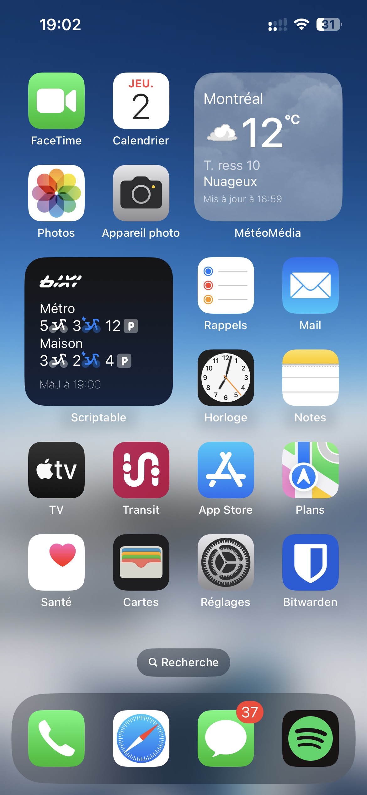
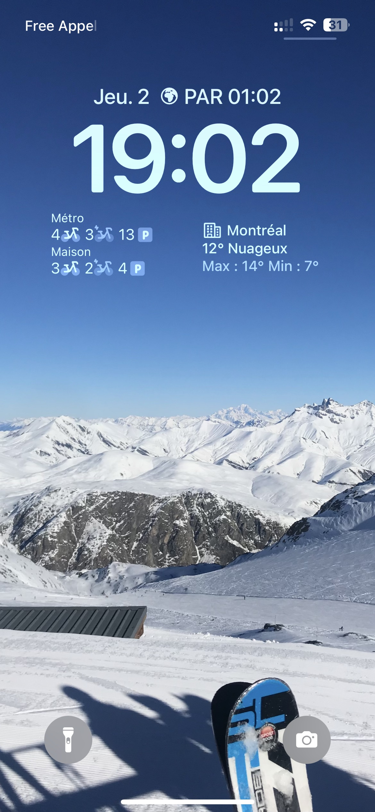

# BIXI Widget
État des stations de vélo-partage BIXI Montréal depuis un widget iOS/iPadOS via [Scriptable.app](https://scriptable.app).

## Fonctionnalités
- [x] Affichage du nombre de vélos, vélos électriques et points d'ancrage de 2 stations favorites
- [x] Affichage de la date de dernière actualisation
- [x] Version Home Screen (small) et Lock Screen (rectangular)
- [x] Mise en cache des icônes personnalisées
- [x] Mise en cache des données (ne plante pas si hors connexion)
- [ ] Changement des stations favorites affichées en fonction de la localisation de l'appareil

## Utilisation
1. Copier le contenu du fichier `bixi-widget.js` ou importer le fichier `Bixi-widget.scriptable` dans Scriptable
2. Ouvrir l'éditeur Scriptable et modifier les labels et identifiants des stations favorites lignes 24 et 25. Pour obtenir un identifiant de station, utilisez cette page web : [liste des stations BIXI Montréal (lab.deltaplane.dev)](https://lab.deltaplane.dev/bixiwidget/stations.html)
3. Ajouter un widget Scriptable sur l'écran d'accueil ou écran de verrouillage (optimisé pour widgets petits/rectangulaires uniquement)
4. Paramétrer le widget (appui long) avec le script Bixi Widget. Paramétrage conseillé : `When Interacting -> Open URL` et `URL -> bixi://`, cela aura pour effet d'ouvrir l'application Bixi lors d'un clic sur le widget.

## Captures d'écran
| Home Screen                       | Lock Screen                       |
|-----------------------------------|-----------------------------------|
|  |  |
